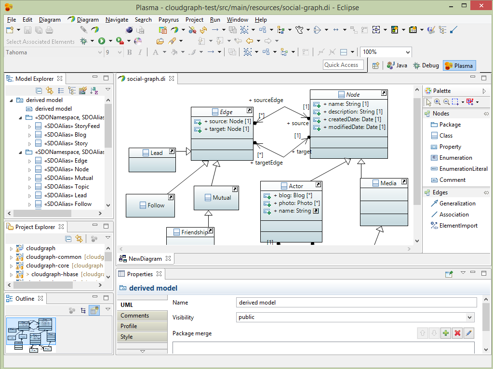

>   Plasma

TerraMeta Software, Inc.

-   Plasma Data Studio

PlasmaSDO® and PlasmaQuery® are registered

Trademarks of TerraMeta Software, Inc.

**Introduction**
================

Plasma is a data store agnostic, object mapping and object query framework
written in a Java™ with Maven tools for metadata ingestion and conversion. At
its core, Plasma contains a directed graph or digraph model and a set of
metadata driven graph traversal algorithms. Data Objects under Plasma form a
digraph transparently as a client manipulates the SDO API, graph edges or links
being automatically created and used internally to manage associations between
Data Object nodes. Data store provider implementations are available for Apache
HBase, MAPR-DB (M7) and various relational database vendors.

The Plasma metadata extensions are described in a UML profile which contains UML
stereotypes, enumerations and other elements used to enrich UML models for use
within the Plasma core as well as third party Data Access Service (DAS)
providers. Particular design consideration has been focused on leaving each
stereotype granular with only a few tightly related attributes/tags, rather than
more monolithic stereotype groupings. This approach lets each stereotype convey
far more meaning and maps well to metadata oriented extensions in various target
languages, such as Java™ annotations. This granular approach can however have
the effect of making UML diagrams more cluttered depending on the presentation
settings of the UML diagramming tool.

A single UML logical model fully enriched or annotated with the Plasma UML
profile provides enough context specific information to support various
technology-specific runtime environments and the generation of numerous context
or platform-specific models as well as many other related source-code and other
artifacts.

**Plasma Data Studio**
======================

Plasma Data Studio is an Eclipse based IDE for annotating and integrating UML
models with Maven (M2E) based Java projects. The UML editor is derived from
Eclipse Papyrus components. See <https://www.eclipse.org/papyrus>. It is
centered around a custom Eclipse perspective,

Plasma perspective, and a custom UML palette. UML Models are annotated using a
custom UML profile and datatypes package, both of which are fully integrated or
registered in the IDE. The below screen shot pictures a UML model being edited
in-line with a standard Java Eclipse project.

Figure 1 - Plasma Data Studio
